\center

# **Laboratoire 5: Conception d’une interface fiable**

\hfill\break

\hfill\break

Département: **TIC**

Unité d'enseignement: **ARE**

\hfill\break

\hfill\break

\hfill\break

\hfill\break

\hfill\break

\hfill\break

\hfill\break

\hfill\break

\hfill\break

\raggedright

Auteur(s):

- **CECCHET Costantino**
- **JALUBE Miguel**

Professeur:

- **MESSERLI Etienne**
  
Assistant:

- **CONVERS Anthony**

Date:

- **Décembre 2023**

\pagebreak

## Sommaire

- [Introduction](#introduction)

- [Conception de l'interface](#conception-de-linterface)

  - [Plan d'adressage](#plan-dadressage)

  - [Réalisation du circuit](#réalisation-du-circuit)

    - [Canal d'écriture](#canal-décriture)

    - [Canal de lecture](#canal-de-lecture)

    - [Machine d'état pour la lecture fiable](#machine-détat-pour-la-lecture-fiable)

  - [Synthèse](#synthèse)

- [Simulation](#simulation)

- [Programme C](#programme-c)

- [Conclusion](#conclusion)

- [Annexe(s)](#annexes)

\pagebreak

## **Introduction**

Pour ce laboratoire, il est demandé de réaliser une interface fiable, connectée sur le bus Avalon interconnectant l'HPS (microcontroller) et l'FPGA de la carte DE1-SoC.

L'arborescence de fichiers de base du projet a été fourni par les responsables de cours.

\hfill\break

## **Conception de l'interface**

### **Plan d'adressage**

Comme le montre le bloc de l'interface a concevoir:

\center

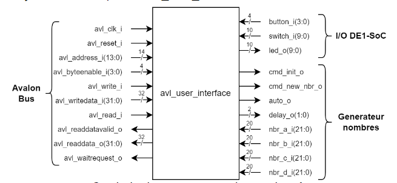{ width=90% }

\raggedright

\hfill\break

Elle ne reçoit que 14bits pour l'adresse.

Ceci s'explique par le fait que le bus de données est sur **32bits**. Dès lors, une valeur 32bits doit pouvoir s'adresser de telles façons à accèder à chacun de ces bytes, soit:

\small

```shell
|   REGISTRE     32     BITS    |
| ----------------------------- |
| BYTE3 | BYTE2 | BYTE1 | BYTE0 |
|      0x3     0x2     0x1     0x0 Offset à partir de l'adr. de base du reg.
```

\normalsize

\hfill\break

Ce faisant, les adresses dans le plan d'adressage doivent être alignées sur 2bits, autrement dit, alignées sur 4. **Ce qui enlève les 2 premiers bits de poids faibles.**

Ensuite, le manuel de référence technique du processeur nous indique que le bus AXI lightweight débute à l'adresse 0xFF20'0000, avec une mémoire allouée de 2MB. **Il en est déduisible que les 11 derniers bits de poids forts sont décodés par ce dernier.**

De plus, la zone attribuée aux étudiants est présenté avec le tableau ci-dessous:

\center

\small

| Offset on bus AXI lightweight HPS2FGPA | Fonctionnalités |
| :-------------: | --------------- |
| 0x00_0000 - 0x00_0003 | Constante ID 32Bits (Read only) |
| 0x00_0004 - 0x00_FFFF | reserved |
| **0x01_0000 - 0x01_FFFF** | **Zone à disposition des étudiants** |
| 0x02_0000 - 0x1F_FFFF | not used |

\normalsize

\raggedright

Une constante ID de 32bits est retrouvée, mais cette dernière est implémentée par le *design* des responsables de cours. De fait, l'interface à concevoir est derrière le *design* sus-mentionné **et donc, les bits utilisés par l'interface à concevoir sont alors les 14bits d'adresse 15 à 2.**

\hfill\break

Le plan d'adressage aiaint comme adresse de base 0xFF200000 a ensuite été définit comme suit:

| Address (CPU Side) [16..0] | Address (Itf side) [15..2] | Definition | R/W | BITS |
| :----------: | :---------: | :------------- | :-: |
| 0x1_0000 | 0x0000 | Constant ID (**0xDEADBEEF**) | R | [31..0] |
| 0x1_0004 | 0x0001 | IN: Keys | R | [3..0] |
| 0x1_0008 | 0x0003 | IN: Switches | R | [9..0] |
| 0x1_000C | 0x0003 | OUT/IN: LEDs | R/W | [9..0] |
| 0x1_0010 | 0x0004 | OUT/IN: Status/Config.[^1] | R/W | [1..0]/[4] [0] |
| 0x1_0014 | 0x0005 | OUT/IN: Mode/Speed | R/W | [4] [1..0] |
| 0x1_0018 | 0x0006 | *unused* | - |
| 0x1_001C | 0x0007 | OUT: Photo | W | [0] |
| 0x1_0020 | 0x0008 | IN: nbr_a | R | [31..0] |
| 0x1_0024 | 0x009 | IN: nbr_b | R | [31..0] |
| 0x1_0028 | 0x0010 | IN: nbr_c | R | [31..0] |
| 0x1_002C | 0x0011 | IN: nbr_d | R | [31..0] |
| 0x1_0030 | 0x0012 | *reserved* | - | - |
| 0x1_003C | 0x1000 | *not used* | - | - |

[^1]: *Status/Config.*: en suivant le plan d'adressage fourni par les responsables de cours, les bits de status sont *read only* et les bits de configuration sont *write only*.

\pagebreak

Justification du plan d'adressage:

\hfill\break

- La première constante permet d’identifier l’interface à concevoir,
conformément à la donnée du laboratoire

- Pour les offset 0x18 et 0x1C, il a été décidé de n'utiliser que l'offset 0x1C et son bit 0 affin de gérer la prise de photo des registres 0x20 à 0x2C. Nous avons décidé de ne pas utiliser l'offset 0x18, car la prise de photo et son aquittement peuvent être gérés par le bit 0 de l'offset 0x1C.

\hfill\break

### **Réalisation du circuit**

La circuiterie a été coupée en 3 parties majeures; **lecture**, **écriture** et une machine d'état pour la lecture fiable.

\center

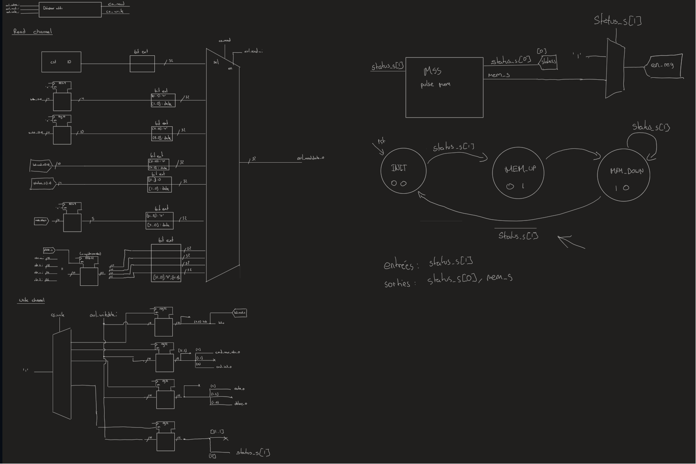{ width=90% }
(Pour une vue plus précise voir le document schema_bloc.pdf)

\raggedright

\hfill\break

\pagebreak

#### **Canal d'écriture**

\

Ce canal possède un DEMUX qui permet de choisir lequel des 4 registres écrivables (voir tableau en titre **[Plan d'adressage](#plan-dadressage)**) sera écrit.

\hfill\break

Le schéma résultant se présente ainsi:

\center

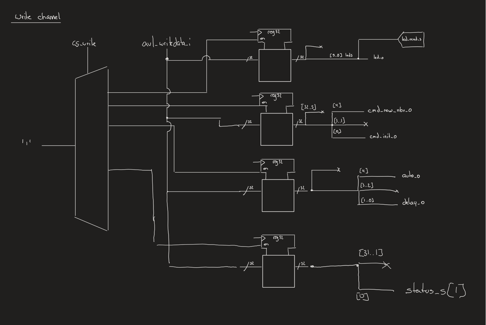{ width=70% }

\raggedright


\pagebreak

#### **Canal de lecture**

\

Pour celui de lecture, c'est un MUX qui permet de choisir parmis les 9 registres lisibles (voir tableau en titre **[Plan d'adressage](#plan-dadressage)**) celui qui sera lu.

\hfill\break

En voici son schéma:

\center

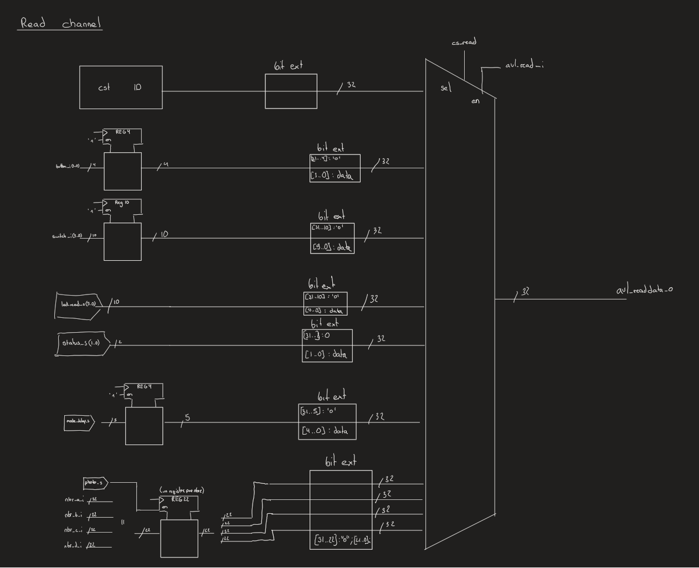{ width=70% }

\raggedright

\hfill\break

Lors de la lecture d'une donnée, un décalage d'une période d'horloge est effectuée pour obtenir le signal *avl_read_datavalid* à partir du signal *avl_read_i*.

\pagebreak

#### **Machine d'état pour la lecture fiable**

\

Pour la lecture fiable, une machine d'état a été implémentée, afin de gérer un signal de prise de photo, ainsi que son acquittement.

\hfill\break

Voici le diagramme de la machine d'état.

\center

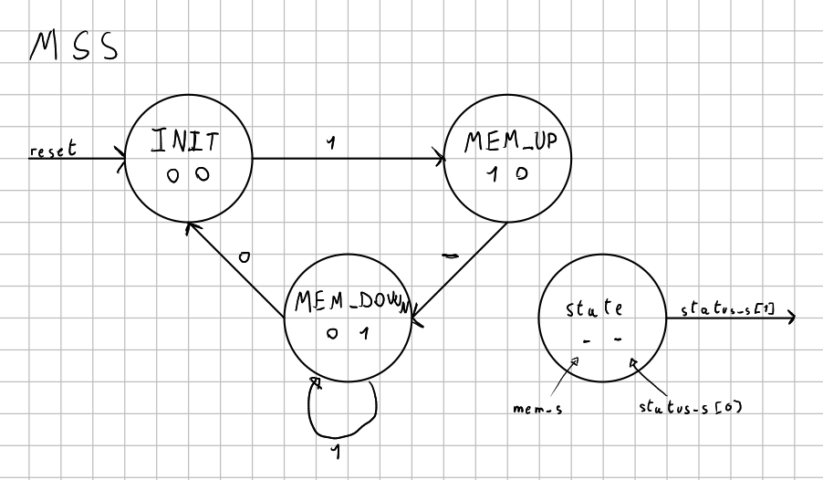{ width=90% }

\raggedright

Cette machine a été concue sur la base de ces diagrammes de flux:

\center
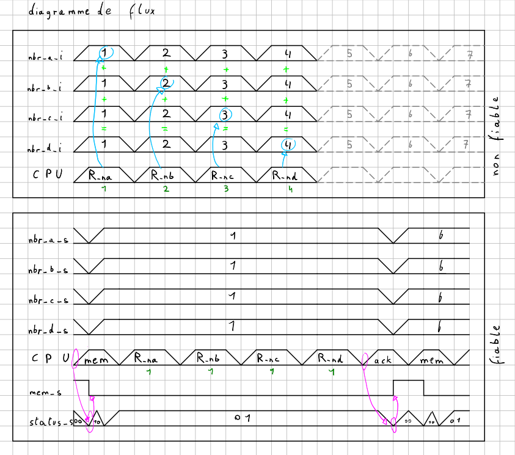{ width=100% }

\raggedright
\pagebreak

### Synthèse

Après discussion avec l'enseignant, la vue RTL et la quantité de logique ne sont plus très parlantes, de part l'explosion de logiques. Cependant, une autre information, permettant un contrôle plus approchable, est la quantité de registres dédiées au *design*.

\hfill\break

Sous le report de synthétisation: `Fitter > Resource Section > Resource Utilization by Entity`, à l'aide du filtre et en cherchant *avl_user_interface*, on trouve cette information:

\center

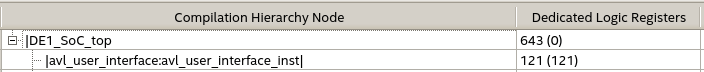{ width=95% }

\raggedright

\hfill\break

Chaque registre peut être compté, afin de retrouver la valeur qui devrait être obtenue.

|  | Size (bits) | | Size (bits) |
| :--------------- | :--: | :----------- | :--: |
| Données des LEDs sur DE1SoC | **10** | Status | **2** |
| Mode + Speed  | **3** | New + Init | **2** | 
| Nombres | **22\*4** |  readdatavalid | **1** |
| readdata | **32**  |Machine d'état | **3** | 


\hfill\break

Ce qui amène alors à:

$Dedicated Logic Registers = 10 + 2 + 3 + 2 + 22*4 +  + 1 
32 + 3 = 141$
\hfill\break

Les constantes, tel que la constante ID du périphérique, sont connectées en dures et ne comptent alors pas dans le compte de registres.

Mais nous voyons une disparitée entre le compte de registres et le compte de registres dédiés au *design* offert par Quartus. En effet, le compte de registres dédiés au *design* est de 121, alors que le compte de registres est de 141.

Ceci même si l'on compile le avl_user_interface seul, sans le reste du projet (138 au lieu de 141).
ces 3 bit son du au fait que quartus optimise les bits de status, la machine d'etat et le bit de memorisation en effet la machine detat ne va utiliser que 2 bit car letat init est 00 et le bit de status 0 est affecté grace a un bit de la machine d'etat et de meme pour le bit de memorisation qui est affecté par le bit de status 1.

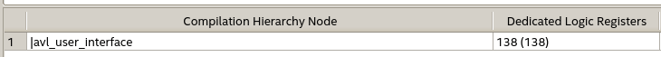{ width=95% }

Ceci est dû au fait que le compilateur de Quartus optimise le code.

Trouver a quel endroit ces optimisations sont faites est difficile.L'option la plus probable est que quartus ne va pas shyntethiser certain registres au complet, comme par exemple readdata qui devrait faire 32 bits mais est vraiseblablement optimisé en 23 bits.
22 pour sa valeur la plu grande qu'sont les nobres générés et 1 pour la constante ID.

Ceci a été dicuté avec le professeur et il nous a dit que c'était normal et que trouver exactement ou quartus optimise était très difficile.

Nous avons décidé de ne pas chercher plus loin et de continuer avec cette valeur de registres.

\pagebreak

## **Simulation**

Différentes phases de simulations ont été exécutées. Ces dernières peuvent être représentées avec les séquences sauvegardées, à l'aide de la console.

\hfill\break

Voici leur test respectif:

0. Test des lectures des IDs, ainsi que l'écriture de la constante de debug

1. Test des lectures des entrées utilisateurs: Bouttons et interrupteurs

2. Test de l'écriture et relecture des LEDs de la DE1


\hfill\break

Pour ne pas surcharger le rapport, l'analyse des chronogrammes, avec effet sur la console est annexé à la **[fin](#simulation-chronogrammes-et-consoles)**.

\pagebreak

## **Programme C**

Pour le programme, la base a été reprise du dernier laboratoire. Cependant, le programme a été modifié pour satisfaire les contraintes du cahier des charges.

\hfill\break

Un module **interface** implemente les fonctions de lecture et d'écriture de l'interface, afin de satisfaire les contraintes décrites par la donnéedu labo. .

Le module se contente du minimum pour cette interface, mais elle est facilement modulable.

\hfill\break

Selon la compréhension du cahier des charges, voici quelques clarifications quant au comportement du programme:

- Lors de l'écriture sur les registre de initialisation et de reset pour le generateur de nombres, le programme cree une pulse sur  ce dernier.
Ceci à été fait pour ne pas avoir à gérer cette pulse grâce a une machine d'état dans le vhdl.

- Lors de la lecture des nombres en mode fiable, deux solutions ont été discutée avec le professeur:

  - La première consiste à demander une prise de photo, et laisser a l'utilisateur la mission de lire les nombres avant de relancer une prise de photo. Cette solution est simple à implémenter.

  - La deuxième consiste à demander une prise de photo et d'attendre un aquittement de la part de l'utilisateur avant de pouvoir relancer une prise de photo. Cette solution est plus complexe à implémenter.

  Nous avons implémenté cette solution, car elle est plus proche du cahier des charges.

\pagebreak
## **Test**

Les tests de la partie une ont donnée des résultats corrects. Le chronogramme montre cette liste d'actions dans l'ordre :
1. Initialisation de l'interface
2. Lecture de l'ID en 0x0
3. Lecture de l'ID en 0x10000
4. Allumage de toutes les LEDs
5. Lecture des switchs (SW4 activé)
6. Lecture des boutons (KEY0 activé)
7. Passage en mode manuel
8. Génération d'un nouveau nombre
9. Lecture du nombre généré
10. Génération d'un nouveau nombre
11. Lecture du nombre généré
12. Passage en mode automatique et frequence 1 MHz
13. Lecture du nombre généré (jusqu'à voir un changement)

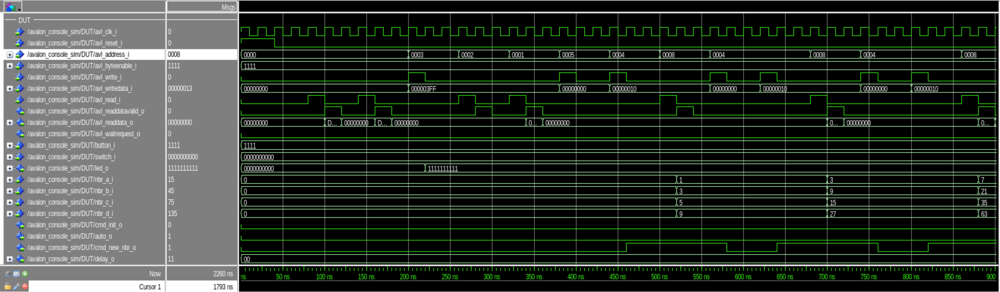{ width=80% }

Comme on peut voir dans le chronogramme, on demande un nombre en mettant le signal new_nbr à 1 puis lorsque l'on a lu le nombre on met le signal new_nbr à 0 pour le mode manuel. Dans le deuxième chronogramme on peut voir le fonctionnement du mode automatique. La fréquence est définie à 1 MHz et on peut voir à la fin du chronogramme la génération de nouveau nombres sans avoir besoin du signal new_nbr.

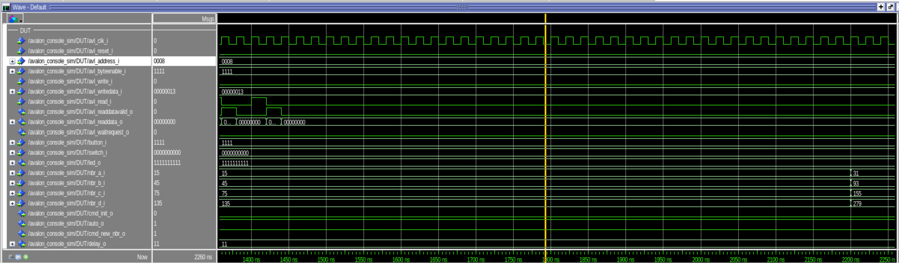{ width=80% }

Tests TCL/TK :
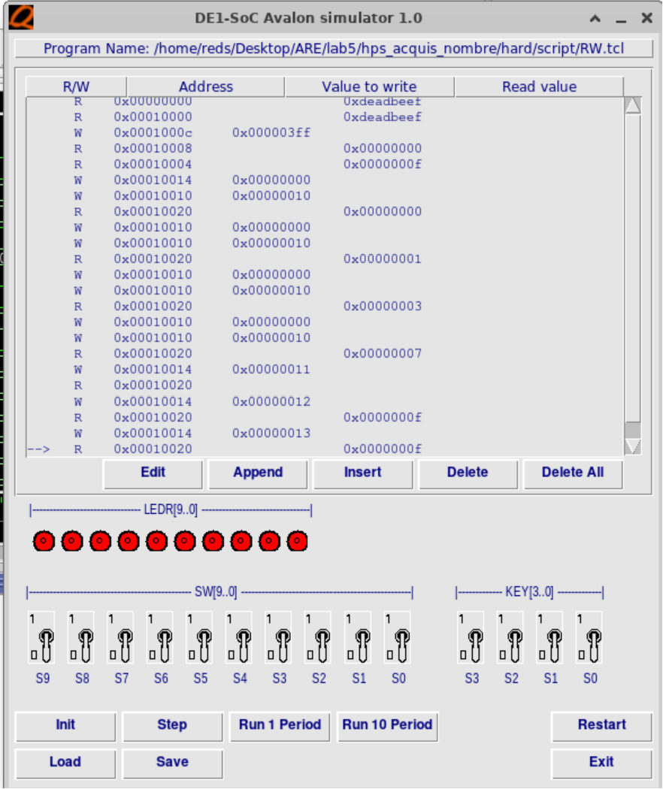{ width=80% } 

## **Conclusion**

Pour conclure, le laboratoire a été réalisé avec succès! Le cahier des charges est rempli et tant le *design*, que le programme, sont tout 2 facilement modifiables au besoin. Une seule des deux adresses à ouvertes à usage des étudiants a été utilisée (Offset 0x1C), mais la deuxième est disponible pour une éventuelle extension du projet. Pour ce qui est du programme C il est important de noter que dans le mode manuel lors de l'initialisation et la demande d'un nouveau nombre, c'est au logiciel de mettre les deux signaux à respectivement à 1 et ensuite à 0 cette partie aurait pu être couverte par une machine d'état mais nous avons préféré laisser le logiciel gérer cette partie afin de simplifier le code de l'interface.


\hfill\break

## Annexe(s)

- [Simulation: Chronogrammes et Consoles](#simulation-chronogrammes-et-consoles)

  - [IDs contrôle](#ids-contrôle)

  - [Lecture des entrées utilisateurs](#lecture-des-entrées-utilisateurs)

  - [Écriture/Relecture des LEDs sur DE1SoC](#écriturerelecture-des-leds-sur-de1soc)

  - [Maintien du write enable d’écriture sur MAX10](#maintien-du-write-enable-décriture-sur-max10)

- [Mesures write enable](#mesures-write-enable)

  - [Write enable de 1.1us - 1](#write-enable-de-1.1us---1)

  - [Write enable de 1.1us - 2](#write-enable-de-1.1us---2)

  - [Write enable de 1us](#write-enable-de-1us)

  - [Indication sur la mesure](#indication-sur-la-mesure)

\pagebreak

### Simulation: Chronogrammes et Consoles

\hfill\break

#### IDs contrôle

\

\center


\raggedright

Ici, il est constaté que la valeur lue de l'ID (côté étudiant) est faite correctement et que le bit de *read_datavalid* est active, un coup d'horloge après *read_i*.

\hfill\break

\center


\raggedright

Ce chronogramme permet de voir que la lecture, la modification et la relecture de la constante de *debug* fonctionne.

\hfill\break

\center


\raggedright

En forçant les valeurs de *read_i* et de *avl_address_i*, le dernier chronogramme montre que la lecture consécutive de deux registres différents fonctionnent.

\pagebreak

\center


\raggedright

Sur la console, ces instructions permettent de confirmer que seul les bits 15 à 2 sont utilisés pour adresser l'interface.

\hfill\break

#### Lecture des entrées utilisateurs


\raggedright

Ce chronogramme permet de valider que les valeurs des interrupteurs et des boutons sont bien reportées, lors de leur lecture.

\hfill\break

Ce qui est validé, également avec la console ci-dessous:

\pagebreak

#### Écriture/Relecture des LEDs sur DE1SoC

\hfill\break

Le chronogramme et les consoles vérifient le fonctionnement souhaité, transmis par les chronogrammes du bus Avalon (dans le dossier /doc, mis à disposition).

\pagebreak
